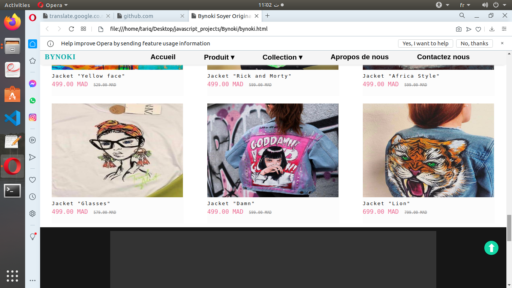
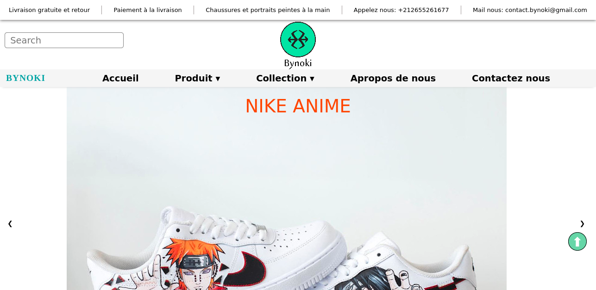
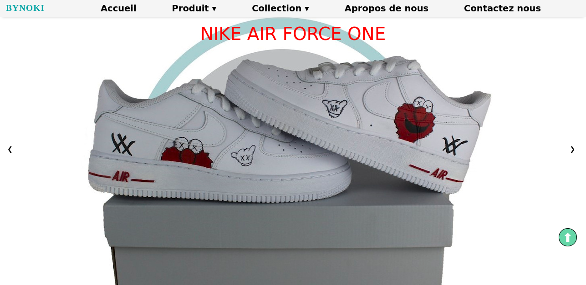
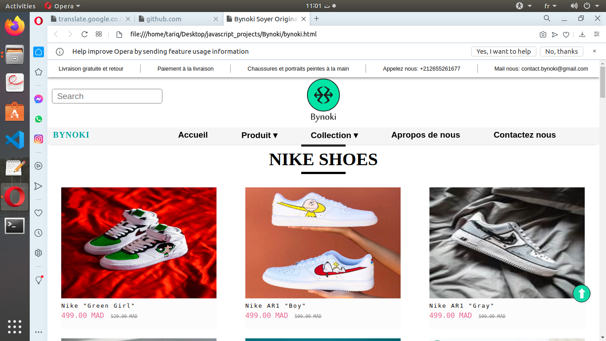
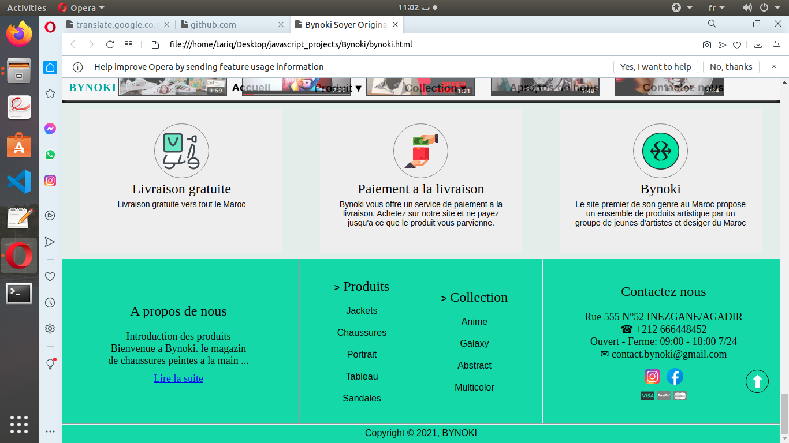
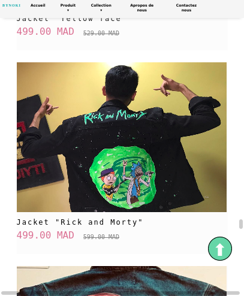

# Bynoki homepage

In this project [Bynoki] i try to build the homepage for e-commerce website that show the product and their information, silde bar and a video controller for the artist and in the footer same info about the company respecting as possible the user experience.

## Table of contents

- [Bynoki homepage](#bynoki-homepage)
  - [Table of contents](#table-of-contents)
  - [Overview](#overview)
    - [The challenge](#the-challenge)
    - [Screenshot](#screenshot)
    - [Links](#links)
  - [My process](#my-process)
    - [Built with](#built-with)
    - [What I learned](#what-i-learned)
    - [Continued development](#continued-development)
  - [Author](#author)

## Overview

The goal of this project is to practice what i learned about html, css, JavaScript and DOM manipulation, the project is homepage for e-commerce website.

### The challenge

- Build menu bar with drop-down options.
- Organize products in flex layout.
- Build pictures slider.
- Add video controller.
- respect user experience

### Screenshot

### Links

- Live Site URL: [https://tariqelb.github.io/Bynoki-homepage/](https://tariqelb.github.io/Bynoki-homepage/)

## My process

### Built with

- Semantic HTML5 markup
- CSS custom properties
- Flexbox
- JavaScript
- Document Object Module (DOM)

### What I learned

In this challenge i learned how to use DOM, event, function , costom css properties and mony other thing to build a homepage.

### Continued development

The project not yet finish its need template for every product database for search bar and some other things i still working on it.

## Author

- Facebook - [Tariq El bouhali](https://www.facebook.com/tariqelbouhali)